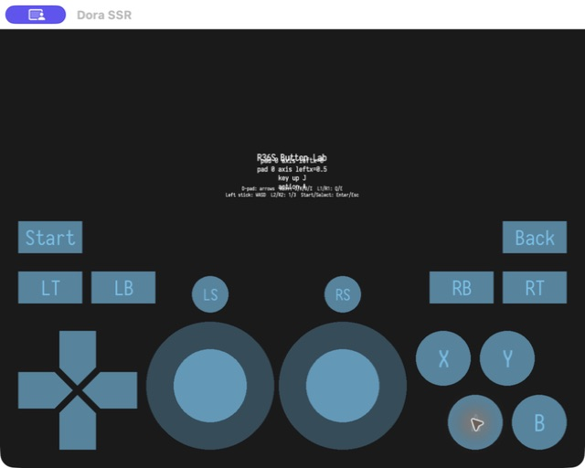

# R36S Button Lab

This Dora SSR project verifies that three input sources produce the same game
actions:

1. Desktop keyboard events.
2. Dora's clickable `GamePad` component.
3. The physical `GO-Super Controller` built into the R36S.



## What is simulated

- `GamePad` draws the full handheld control layout and injects virtual
  controller events with `emitButtonDown`, `emitButtonUp`, and `emitAxis`.
- Keyboard bindings feed the same `InputManager` actions as the physical pad.
- The R36S physical `GO-Super Controller` therefore needs no game-logic fork.

`L2` and `R2` are axes in Dora, not `ButtonName` values. The controller's
`Guide`/function button is not part of Dora's standard `ButtonName` enum.

## Run locally

```bash
./dora-lab start
./dora-lab buildrun
```

The first command starts Dora SSR and opens `http://localhost:8866/`. Keep that
Web IDE tab open: Dora's TypeScript compiler is provided by the Web IDE. The
wrapper installs the project API definitions on first build.

The window uses the handheld's logical `640x480` resolution on desktop. Verify:

```bash
./dora-lab log | grep BUTTON_LAB_SELF_TEST_OK
```

## Desktop mapping

| Handheld input | Keyboard |
| --- | --- |
| D-pad | Arrow keys |
| A / B / X / Y | J / K / U / I |
| L1 / R1 | Q / E |
| Left stick | W / A / S / D |
| L2 / R2 | 1 / 3 |
| L3 / R3 | Z / C |
| Select / Start | Escape / Enter |
